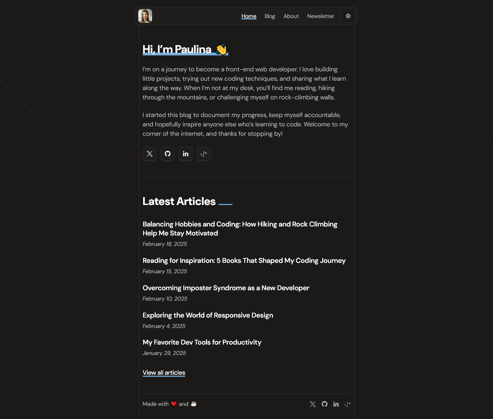

# Frontend Mentor - Personal blog solution

This is a solution to the [Personal blog challenge on Frontend Mentor](https://www.frontendmentor.io/challenges/personal-blog-lJpVCnmozL).

## Table of contents

- [Overview](#overview)
  - [The challenge](#the-challenge)
  - [Screenshot](#screenshot)
  - [Links](#links)
- [My process](#my-process)
  - [Built with](#built-with)
  - [What I learned](#what-i-learned)
  - [Continued development](#continued-development)
  - [Useful resources](#useful-resources)
- [Author](#author)

## Overview

### The challenge

Users should be able to:

- Navigate to all pages by clicking links or using their keyboard
- Read all articles
- Select their color theme
- Submit their email to subscribe to the newsletter
- Receive an error message when the newsletter form is submitted if:
  - The Email Address field is empty
  - The Email Address is not formatted correctly
- Receive a success message if submitted correctly
- View the optimal layout for the interface depending on their device's screen size
- See hover and focus states for all interactive elements on the page

### Screenshot

### Links

- Solution URL: [ solution URL ](https://github.com/Shaimaa01/personal-blog)
- Live Site URL: [ live site URL ](https://personal-blog-rho-wheat.vercel.app/)

## My process

### Built with

- **JavaScript (JS)**
- **[React](https://reactjs.org/)**
- **[React Router DOM](https://reactrouter.com/)**
- **[useContext](https://react.dev/reference/react/useContext)** - Manages global state in React
- **[Tailwind CSS](https://tailwindcss.com/)**
- **[Formik](https://formik.org/)**
- **[Yup](https://github.com/jquense/yup)**
- **[React Markdown](https://github.com/remarkjs/react-markdown)** - Renders Markdown content in React
- **[rehype-highlight](https://github.com/rehypejs/rehype-highlight)** - Adds syntax highlighting to Markdown code blocks
- **[rehype-raw](https://github.com/rehypejs/rehype-raw)** - Allows raw HTML inside Markdown
- **[rehype-sanitize](https://github.com/rehypejs/rehype-sanitize)** - Ensures safe HTML by sanitizing Markdown content
- **[remark-gfm](https://github.com/remarkjs/remark-gfm)** - Enables GitHub Flavored Markdown (tables, strikethrough, etc.)
- **[Vite](https://vitejs.dev/)**
- **[Vercel](https://vercel.com/)**

### What I learned

In this project, I learned:

- **useContext** for managing global state without prop drilling.
- **React Markdown** and its **"black magic"** ✨ with plugins like `rehype-highlight`, `rehype-raw`, and `remark-gfm` to render and enhance Markdown content in React.

### Continued Development

I am currently learning **Sass** to improve my CSS workflow and enhance styling efficiency in future projects.

### Useful Resources

- [useContext Explained Simply](https://youtu.be/FpNfvbNYPsg?si=K2gZtGV__OOHM1t5) - This video helped me understand and simplify the concept of `useContext` in React. Highly recommended for anyone learning state management!

## Author

- Frontend Mentor - [@Shaimaa01](https://www.frontendmentor.io/profile/Shaimaa01)
- Twitter - [@shaimaa385863](https://x.com/shaimaa385863)
